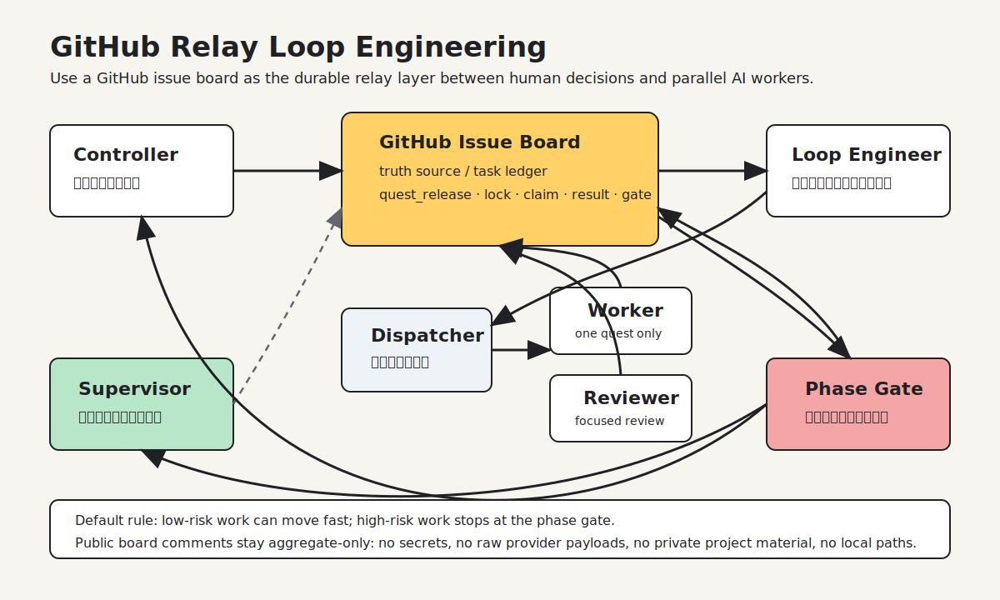

# GitHub Relay Loop Engineering 中文说明

这是一套用 GitHub Issue 任务板来协调多个 AI 编程对话的工作流。

它不是一个“万能 AI 公司”，也不是让模型无限自治。它解决的是一个更具体的问题：当你同时开了多个 AI 工程师、审查员、调度员和监工时，怎么让它们并行工作，但不互相污染、不重复抢任务、不越过产品负责人做高风险决策。

## 一句话解释

把 GitHub Issue 当作项目真相源，把多个 AI 对话拆成固定角色，让它们通过任务板、锁、短账本和阶段门协作。

如果任务板已经很长，就加一层本地快照：本地快照负责快，GitHub 负责准。工人先读本地快照，再只核对自己任务相关的评论、锁、PR 和 CI；如果本地快照和 GitHub 冲突，永远以 GitHub 为准。

## 适合什么场景

- 你想让多个 AI 对话同时干活。
- 你不想把所有日志都堆进主对话。
- 你希望低风险任务自动推进，高风险任务回到人类确认。
- 你需要一个能复用到不同项目的 AI 原生工程工作流。
- 你已经在用 GitHub Issue、Pull Request、评论、分支或远程锁做项目协作。

## 不适合什么场景

- 只有一个很小的任务，用一个对话直接做完就行。
- 项目没有明确的负责人，也没有人愿意做阶段判断。
- 你希望 AI 完全自动合并、发布、上线、删库或处理敏感信息。
- 你不能接受 GitHub Issue 成为公开或半公开的工作记录。

## 核心角色

### Controller

面向人类负责人。它负责回答：现在做得怎么样、能不能继续、风险是什么、下一步该不该开。

### Loop Engineer

循环工程师。它把一个阶段目标拆成具体任务，读结果，继续派发，或者在阶段门停下。

### Dispatcher

调度员。它只负责路由任务，不自己做任务，不自己改代码，不自己做产品判断。

### Worker

工人。它只领取一个明确可做的任务，先锁再 claim，完成后发简短结果，然后停止。

### Reviewer

审查员。它做聚焦审查、绿色通道审查、合并准备检查。

### Supervisor

监工。它不推进产品，而是检查流程有没有卡住、过度派发、边界漂移、输出污染或漏通知。

## 为什么不是直接 Agent-to-Agent

直接让 A 对话规划、B 对话生产、B 再回 A，速度可能更快，但很容易出现几个问题：

- 历史记录只在聊天里，换对话就丢。
- 多个工人同时做事时，很难知道谁真正 claim 了任务。
- 产品负责人要自己读很多长日志。
- 工人容易越过阶段门继续干。
- 失败、阻塞、被替代的工作没有统一账本。

这套流程牺牲一点速度和 token，换来可审计、可暂停、可恢复、可复盘的工程秩序。

## 脱敏案例

假设一个项目要做“可选高级模式”：

1. Controller 在 GitHub Issue 里写清楚目标和边界。
2. Loop Engineer 拆出几个 quest：产品契约、设置入口、状态展示、默认关闭验证。
3. Dispatcher 看到 quest_release 后，把任务发给合适的 Worker。
4. Worker 刷新任务板，创建锁，claim 一个任务，完成后只发 aggregate-only 结果。
5. Reviewer 检查低风险 PR 是否可以走绿色合并。
6. Loop Engineer 收口，写 phase_summary / gate_request。
7. Controller 决定：继续、收窄、暂停、合并、停车或进入下一阶段。
8. Supervisor 独立检查有没有漏通知、过度派发或边界漂移。

这个过程里，GitHub Issue 是真相源，聊天只是执行面。

## 三条硬规则

1. 任务板评论只放简短、脱敏、可审计的信息。
2. 生产路径、真实调用、公开发布、删除、合并和关闭路线必须有明确授权。
3. 阶段到达决策点就停，不要让工人无限继续。

## 省 token 的混合工作流

旧流程的问题是：每个工人、审查员、循环工程师都反复重读整条 GitHub Issue。任务板一旦有上百条评论，这会浪费大量 token。

新的推荐流程是：

1. GitHub Issue / PR / 远程锁 / GitHub CI 仍然是最终真相源。
2. 本地维护一个短快照，记录当前阶段、已放行任务、锁、PR、阻塞、阶段门和下一步。
3. 工人开工先读本地快照，再核对自己任务相关的精确 GitHub 评论、锁、PR 和 CI。
4. 只有审计、快照冲突、阶段总结或快照过期时，才重新读完整任务板。
5. 本地测试和构建只是预检；PR CI 和合并后的 main CI 才是阶段门证据。

在大型任务板上，这通常能把单个工人的协调上下文减少八成以上。

## 目录说明

- `docs/methodology.md`: 方法论。
- `docs/workflow.md`: 运行流程。
- `docs/safety-and-hygiene.md`: 安全与输出卫生。
- `templates/`: 可复制的任务板和角色提示词模板。
- `templates/local-board-snapshot.md`: 本地快照模板，用来减少大型任务板的重复读取。
- `codex-skill/`: 可安装到 Codex 的技能版本。

## 推荐用法

先复制 `templates/project-config.example.yaml`，填入自己的项目、任务板和角色信息。

然后为每个阶段开一个 GitHub Issue，把阶段目标、硬边界和完成指标写清楚，再让 Loop Engineer 从这个 Issue 开始工作。

如果你只想试用，不需要一开始就开很多角色。最小配置是：

- Controller
- Loop Engineer
- 一个 Worker
- 一个 Reviewer

等流程跑顺后，再加入 Dispatcher 和 Supervisor。
